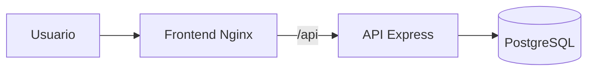

# PlanoPneumatic

Aplicacao operacional para acompanhar pedidos de venda, bases de troca e garantias, desde a triagem ate o encerramento do processo.

## Visao geral

O projeto possui frontend estatico, API HTTP em Express e PostgreSQL.



### Principais areas

- Dashboard operacional com indicadores, atencao e proximas acoes.
- Triagem de pedidos de venda, bases de troca e garantias.
- Historico com filtros, consulta de detalhes, alteracao de status e edicao de dados.
- Relatorios operacionais.
- Administracao de usuarios e criacao de contas.
- Conta do usuario e configuracoes do sistema.

## Requisitos

- Docker Desktop com Docker Compose.
- Ou Node.js 20+ e PostgreSQL 16+ para executar os processos separadamente.
- PowerShell, Bash ou terminal equivalente.

## Executar localmente

A forma recomendada e subir os tres servicos com Docker Compose:

```bash
docker compose up -d --build
```

Acesse:

- Aplicacao: http://localhost:3000
- Health check da API: http://localhost:3000/health
- Health check atraves do frontend: http://localhost:3000/api/health

Para acompanhar os logs:

```bash
docker compose logs -f api
docker compose logs -f frontend
```

Para parar os containers sem remover os dados do PostgreSQL:

```bash
docker compose down
```

Para remover tambem o volume local do banco, somente quando for necessario recriar o ambiente:

```bash
docker compose down -v
```

## Acesso de desenvolvimento

Os usuarios iniciais sao criados na primeira inicializacao do banco. Os valores padrao estao em `.env.example` e servem apenas para desenvolvimento local.

- Administrador: `admin@planopneumatic.com`
- Operador: `operador@planopneumatic.com`

Altere as senhas antes de compartilhar o ambiente ou publicar a aplicacao.

## Estrutura do projeto

```text
backend/       API Express, banco, schema inicial e seeds
frontend/      HTML, CSS e JavaScript do navegador
docs/          Requisitos de negocio e guias operacionais
Dockerfile     Imagem da API
Dockerfile.frontend
               Imagem do frontend Nginx
nginx.conf     Proxy do frontend e health check
docker-compose.yml
               Ambiente local completo
scripts/       Scripts de inicializacao de containers
```

## Documentacao tecnica

- [Executar o backend](docs/backend.md)
- [Executar o frontend](docs/frontend.md)
- [Publicar no Railway](docs/railway.md)
- [Requisitos funcionais](docs/)

## API principal

- `POST /api/auth/login`
- `POST /api/auth/logout`
- `GET /api/auth/me`
- `GET /api/dashboard/summary`
- `GET /api/pending`
- `GET /api/cases`
- `POST /api/cases`
- `GET /api/cases/:caseNumber`
- `PATCH /api/cases/:caseNumber`
- `PATCH /api/cases/:caseNumber/status`
- `GET /api/users`
- `POST /api/users`
- `PATCH /api/account`
- `GET /api/health`

As rotas protegidas exigem o header `Authorization: Bearer <token>`.

## Qualidade antes do deploy

Execute as verificacoes basicas:

```bash
node --check backend/server.js
node --check frontend/app.js
node --check frontend/admin-page.js
node --check frontend/case-editor.js
node --check frontend/history-editor.js
docker compose config
docker build -t planopneumatic-api-check .
docker build -f Dockerfile.frontend -t planopneumatic-frontend-check .
```

## Versionamento e publicacao

O nome recomendado para o repositorio e `PlanoPneumatic`. Antes de publicar:

1. Remova ou substitua credenciais de desenvolvimento.
2. Confirme que `.env` nao esta sendo versionado.
3. Execute os checks acima.
4. Inicialize o repositorio Git e crie o primeiro commit.
5. Conecte o repositorio remoto.
6. Configure os servicos do Railway conforme [docs/railway.md](docs/railway.md).

Nao coloque senhas, tokens ou `DATABASE_URL` no repositorio.
